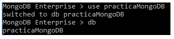

# Practica MongoDB

Práctica para la asignatura de base de datos

## Ejercicio 1

Crear una base de datos

En MongoDB no existe ningún comando estilo CREATE DATABASE, ni nada así, lo que hace mongodb es crear una colección (base de datos) en el momento que se le inserta un objeto o documento (registro de una tabla por llamarlo de alguna forma) a dicha colección.
He creado la base de datos con el comando use practicaMongoDB y luego he usado el comando db para comprobar que me encuentro en la base de datos que acabo de crear:

## Ejercicio 2

Tener una colección

Para ver las colecciones que tengo hay que usar el comando <em>show collections</em>: