# Practica MongoDB

Práctica para la asignatura de base de datos

## Ejercicio 1

Crear una base de datos

En MongoDB no existe ningún comando estilo CREATE DATABASE, ni nada así, lo que hace mongodb es crear una colección (base de datos) en el momento que se le inserta un objeto o documento (registro de una tabla por llamarlo de alguna forma) a dicha colección.
He creado la base de datos con el comando use practicaMongoDB y luego he usado el comando db para comprobar que me encuentro en la base de datos que acabo de crear:

## Ejercicio 2

Tener una colección

Para ver las colecciones que tengo hay que usar el comando <em>show collections</em>:

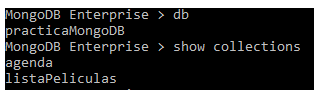

## Ejercicio 3

Insertar, modificar y borrar documentos en la colección

Para insertar documentos dentro de la colección, primero tenemos que añadirlos, por ejemplo películas, se añaden de la siguiente manera:

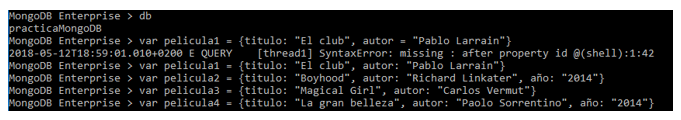

Ahora esos objetos que hemos creado los tenemos que insertar en una colección, por ejemplo en <em>listaPeliculas</em>:

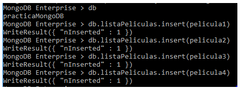

Para visualizar lo que hay dentro de la colección lo he hecho de la siguiente manera:

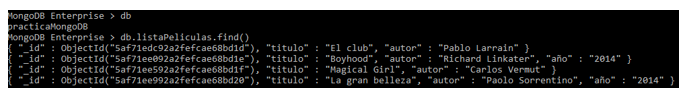

Para visualizar solo un documento de la colección:

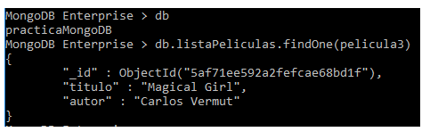

Hay varias formas para modificar un documento de una colección con MongoDB, el que yo he usado ha sido UPDATE() y $SET

Voy a modificar el año de la película La gran belleza

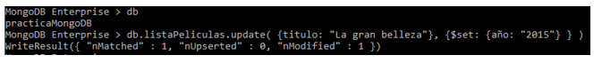

Aquí podemos comprobar que el año se la película se ha modificado correctamente

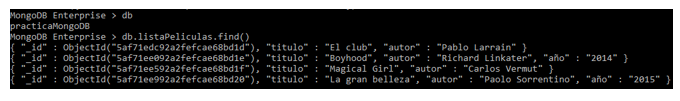

Para eliminar un documento hay que usar los siguientes comandos, lo que he hecho después de eliminar es mstrar un listado de la colección para comprobar que se ha borrado correctamente la película3 cuyo autor es Carlos Vermut:

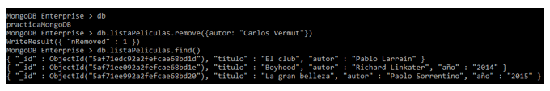

## Ejercicio 4

Crea un índice sobre un campo de la colección

Para crear un índice hay que usar el siguiente comando:

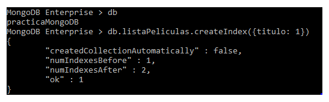

## Ejercicio 5

Realizar consultas en las que utilices, igual, mayor y menor que.

Para estas consultas tengo que insertar  más documentos, en este caso he utilizado la consulta para insertar varios elementos juntos en la colección:

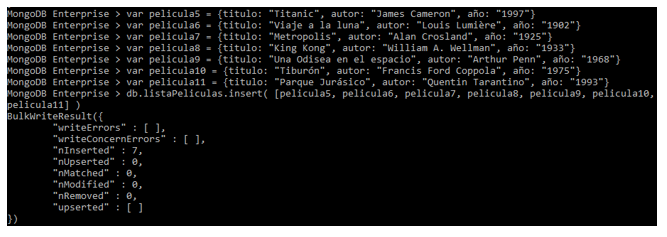

Esta consulta es para mostrar las películas que se hayan lanzado en 2014, (usando el operador de igual que):

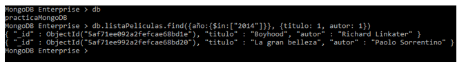

Esta consulta es para mostrar las películas a partir de 1960 (usando el operador de mayor que):

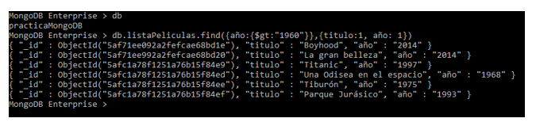

Esta consulta es para mostrar las películas lanzadas antes de 1950 (usando el operador de menor que):

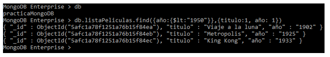

## Ejercicio 6

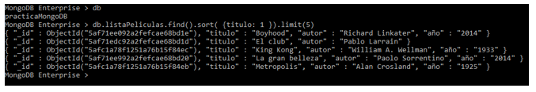
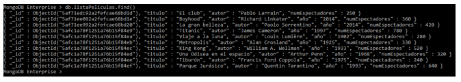
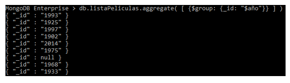

